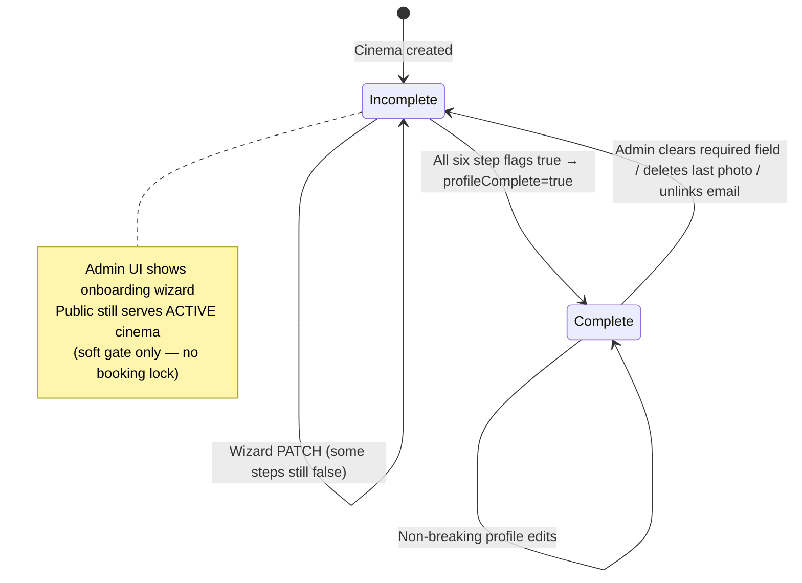
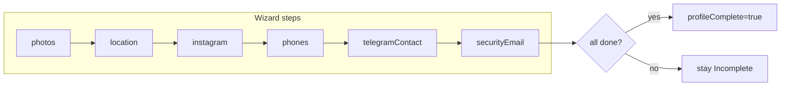
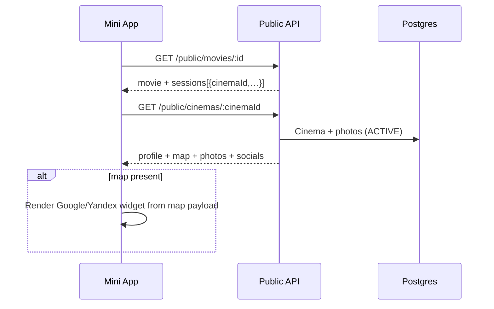

# Cinema Profile, Maps & Onboarding Wizard (KAN-19)

**Status:** contract  
**Unblocks:** KAN-20 (admin wizard FE), KAN-21 (Mini App cinema profile + map)  
**Locale MVP:** `ru`  
**Channel:** Telegram Mini App + Bot  
**Refs:** existing `Cinema` / `CinemaStaff` / `User`; modules `apps/api/src/cinema`, `apps/api/src/public`

## Goal

Extend cinema profile so:

1. **Mini App** — opening a film’s cinema shows map widget (Google or Yandex), Instagram, ordered photos.
2. **Admin** — onboarding / profile-completion wizard when creating or opening a cinema: photos, location, Instagram, contact phones + Telegram, change password, link email for security.
3. Incomplete → complete state machine drives wizard UX and soft-gates (no hard lock of booking for MVP).

Docs-first only — **no Nest implementation in this PR**.

---

## Design decisions (locked)

| Topic | Decision |
| --- | --- |
| Photos | Structured `CinemaPhoto` (`id`, `cinemaId`, `url`, `sortOrder`) — not `String[]` — uploads will grow |
| Map provider | Enum `MapProvider = google \| yandex` on Cinema; FE picks widget from payload |
| Map payload | `{ provider, lat, lng, address, embedHint }` — FE embeds; API does not return provider JS SDKs |
| Profile completion | Explicit boolean step flags + computed `profileComplete` (not bitmask) |
| Legacy `phone` | Keep `Cinema.phone` for backward compat; wizard writes primary into `phones[0]` **and** mirrors to `phone` until FE drops it |
| Security steps | Password change + email link are **User / CinemaStaff** scoped — admin-auth endpoints only, never public |
| Public geo | Public endpoints expose lat/lng/map only when `lat`/`lng` set and cinema `ACTIVE` |

---

## Schema (summary)

Full Prisma deltas: [schema-deltas.md § KAN-19](./schema-deltas.md#kan-19--cinema-profile--follow).

### Cinema fields (additive)

```prisma
enum MapProvider {
  google
  yandex
}

model Cinema {
  // ... existing: id, name, address?, phone?, logoUrl?, description?, timezone, status ...
  lat              Decimal?     @db.Decimal(10, 7)
  lng              Decimal?     @db.Decimal(10, 7)
  mapProvider      MapProvider? // null until location step done
  instagramUrl     String?
  telegramContact  String?      // @username or t.me link; normalize on write
  phones           String[]     @default([]) // E.164 preferred; display as entered
  // step flags (explicit)
  stepPhotosDone          Boolean @default(false)
  stepLocationDone        Boolean @default(false)
  stepInstagramDone       Boolean @default(false)
  stepPhonesDone          Boolean @default(false)
  stepTelegramContactDone Boolean @default(false)
  stepSecurityEmailDone   Boolean @default(false)
  // computed at read / maintained on write:
  profileComplete  Boolean @default(false)

  photos  CinemaPhoto[]
  follows CinemaFollow[]
}

model CinemaPhoto {
  id        String   @id @default(cuid())
  cinemaId  String
  url       String
  sortOrder Int      @default(0)
  createdAt DateTime @default(now())

  cinema Cinema @relation(fields: [cinemaId], references: [id], onDelete: Cascade)

  @@index([cinemaId, sortOrder])
}
```

### `profileComplete` computation

```
profileComplete =
  stepPhotosDone
  && stepLocationDone
  && stepInstagramDone
  && stepPhonesDone
  && stepTelegramContactDone
  && stepSecurityEmailDone
```

Recompute and persist on every wizard PATCH that flips a step flag. Optional: also recompute in a Prisma middleware / service helper `recomputeProfileComplete(cinemaId)`.

### Step → data invariants (when flag = true)

| Step flag | Required data |
| --- | --- |
| `stepPhotosDone` | ≥ 1 `CinemaPhoto` |
| `stepLocationDone` | `lat`, `lng`, `mapProvider`, `address` non-empty |
| `stepInstagramDone` | `instagramUrl` non-empty, valid URL host `instagram.com` / `www.instagram.com` |
| `stepPhonesDone` | `phones.length >= 1` |
| `stepTelegramContactDone` | `telegramContact` non-empty |
| `stepSecurityEmailDone` | Acting staff user’s `User.email` is non-null **and** verified (see security endpoints); for SUPER_ADMIN creating cinema without staff yet: mark done when at least one `CinemaStaff` with `CINEMA_ADMIN` has email linked |

MVP: Instagram / Telegram contact steps **may** be marked done with placeholder skip? **No** — all six required for `profileComplete = true`. Product may later add `skipInstagram` — out of scope.

---

## State machine





Suggested wizard order (UI); API accepts any order / partial PATCHes.

---

## Upload URL flow (photos) — high level

Prefer **presigned PUT** (S3-compatible / R2 / MinIO) so API never streams large binaries:

1. `POST /admin/cinemas/:id/photos/upload-url` → `{ uploadUrl, publicUrl, headers?, expiresAt }`
2. Client `PUT` bytes to `uploadUrl`
3. `POST /admin/cinemas/:id/photos` with `{ url: publicUrl, sortOrder? }` → creates `CinemaPhoto`
4. Optional: `PATCH /admin/cinemas/:id/photos/reorder` with ordered ids
5. `DELETE /admin/cinemas/:id/photos/:photoId`

Multipart fallback (`POST multipart/form-data` to `/admin/cinemas/:id/photos`) is allowed if storage adapter supports it; contract responses identical after create.

Max photos MVP: **12**. Max size / MIME: implementation choice (e.g. 5 MiB, `image/jpeg|png|webp`) — document in OpenAPI when implementing.

---

## Admin wizard API

Base: existing `CinemaController` at `admin/cinemas` — SessionGuard + RolesGuard.  
Roles: `SUPER_ADMIN`, `CINEMA_ADMIN` (staff may **read** profile; only SUPER_ADMIN + CINEMA_ADMIN for that cinema may mutate wizard fields unless noted).

### `GET /admin/cinemas/:id/profile`

Returns cinema + photos + completion breakdown for wizard shell.

```json
{
  "id": "clx...",
  "name": "Navoiy Cinema",
  "address": "…",
  "phone": "+998…",
  "phones": ["+998901234567"],
  "logoUrl": null,
  "description": null,
  "timezone": "Asia/Tashkent",
  "status": "ACTIVE",
  "lat": 41.311151,
  "lng": 69.279737,
  "mapProvider": "yandex",
  "instagramUrl": "https://instagram.com/navoiy",
  "telegramContact": "@navoiy_cinema",
  "photos": [
    { "id": "ph1", "url": "https://cdn…/1.jpg", "sortOrder": 0 }
  ],
  "profileCompletion": {
    "profileComplete": false,
    "steps": {
      "photos": true,
      "location": true,
      "instagram": true,
      "phones": true,
      "telegramContact": false,
      "securityEmail": false
    },
    "missing": ["telegramContact", "securityEmail"]
  },
  "map": {
    "provider": "yandex",
    "lat": 41.311151,
    "lng": 69.279737,
    "address": "…",
    "embedHint": "yandex-maps"
  }
}
```

`map` is `null` when lat/lng missing.

### `PATCH /admin/cinemas/:id/profile`

Partial update of profile fields + optional step auto-advance.

```json
{
  "name": "…",
  "address": "…",
  "description": "…",
  "logoUrl": "…",
  "phones": ["+998901234567", "+998711234567"],
  "instagramUrl": "https://www.instagram.com/navoiy/",
  "telegramContact": "@navoiy_cinema",
  "lat": 41.311151,
  "lng": 69.279737,
  "mapProvider": "yandex",
  "markSteps": {
    "phones": true,
    "location": true,
    "instagram": true,
    "telegramContact": true
  }
}
```

- Validates invariants before setting a step flag `true`; else `400` `STEP_PRECONDITION_FAILED` with `{ step, reason }`.
- Setting `phones` also mirrors `phones[0]` → `Cinema.phone`.
- Normalize `telegramContact`: strip URL to `@username` when `t.me/` / `telegram.me/` detected.
- Recomputes `profileComplete`.
- Response: same shape as `GET …/profile`.

### Photos

| Method | Path | Notes |
| --- | --- | --- |
| `POST` | `/admin/cinemas/:id/photos/upload-url` | Body `{ contentType, byteSize? }` → presign |
| `POST` | `/admin/cinemas/:id/photos` | Body `{ url, sortOrder? }` |
| `PATCH` | `/admin/cinemas/:id/photos/reorder` | Body `{ photoIds: string[] }` full order |
| `DELETE` | `/admin/cinemas/:id/photos/:photoId` | If last photo deleted → `stepPhotosDone=false`, `profileComplete=false` |

On successful create when count ≥ 1, implementation **may** auto-set `stepPhotosDone=true` (or require explicit `markSteps.photos` — prefer **auto-set** for photos).

### Location convenience

`PATCH /admin/cinemas/:id/location`

```json
{
  "provider": "google",
  "lat": 41.31,
  "lng": 69.28,
  "address": "Tashkent, …"
}
```

Sets `mapProvider`, `lat`, `lng`, `address`, `stepLocationDone=true` when all present.

### Security (User / CinemaStaff scoped — admin auth)

These do **not** live under public:

| Method | Path | Purpose |
| --- | --- | --- |
| `POST` | `/admin/cinemas/:id/security/change-password` | Body `{ currentPassword, newPassword }` for **current** session user who is staff of this cinema (or SUPER_ADMIN acting on own account). Updates `User.passwordHash`. Does **not** alone flip `stepSecurityEmailDone`. |
| `POST` | `/admin/cinemas/:id/security/link-email` | Body `{ email }` — set / replace `User.email` for current user; send verification token (channel: email or Telegram deep-link confirm — implementer choice). |
| `POST` | `/admin/cinemas/:id/security/confirm-email` | Body `{ token }` — marks email verified; sets cinema `stepSecurityEmailDone=true` when policy satisfied (see above). |
| `GET` | `/admin/cinemas/:id/security/status` | `{ hasPassword, email, emailVerified, stepSecurityEmailDone }` |

> Password change is available anytime for staff accounts; it is **not** a separate profileCompletion flag. Only **email link/verify** gates `stepSecurityEmailDone`.

### Errors (wizard)

| HTTP | Code | When |
| --- | --- | --- |
| 400 | `STEP_PRECONDITION_FAILED` | Marking step done without required data |
| 400 | `INVALID_INSTAGRAM_URL` | Host not Instagram |
| 400 | `INVALID_MAP_PROVIDER` | Not `google`\|`yandex` |
| 400 | `PHOTO_LIMIT` | > 12 photos |
| 403 | `NOT_CINEMA_STAFF` | User not staff of cinema / not SUPER_ADMIN |
| 404 | `CINEMA_NOT_FOUND` | Unknown id |

---

## Mini App / public endpoints

Align with existing `PublicController` (`@Controller("public")`).

### `GET /public/cinemas`

Extend list select (backward compatible additive fields):

```json
[
  {
    "id": "…",
    "name": "…",
    "address": "…",
    "logoUrl": null,
    "hasMap": true,
    "profileComplete": true
  }
]
```

`hasMap` = lat/lng present. Existing clients ignoring new fields keep working.

### `GET /public/cinemas/:id`

Full public cinema profile for Mini App “cinema sheet” (from film → cinema).

```json
{
  "id": "clx...",
  "name": "Navoiy Cinema",
  "address": "…",
  "description": "…",
  "logoUrl": null,
  "phones": ["+998…"],
  "instagramUrl": "https://instagram.com/…",
  "telegramContact": "@navoiy_cinema",
  "photos": [
    { "id": "ph1", "url": "https://cdn…/1.jpg", "sortOrder": 0 }
  ],
  "map": {
    "provider": "yandex",
    "lat": 41.311151,
    "lng": 69.279737,
    "address": "…",
    "embedHint": "yandex-maps"
  },
  "timezone": "Asia/Tashkent",
  "followerCount": 120,
  "followedByMe": false
}
```

- `404` if cinema missing or `status !== ACTIVE`.
- `map` null if incomplete location.
- `followedByMe` requires Mini App session (Telegram auth); anonymous → `false`.
- Do **not** expose step flags, email, password, or staff ids.

### `GET /public/cinemas/:id/map`

Thin map-only payload (widget bootstrap):

```json
{
  "provider": "google",
  "lat": 41.311151,
  "lng": 69.279737,
  "address": "Tashkent, …",
  "embedHint": "google-maps"
}
```

| HTTP | Code | When |
| --- | --- | --- |
| 404 | `CINEMA_NOT_FOUND` | Missing / not ACTIVE |
| 404 | `MAP_NOT_CONFIGURED` | No lat/lng |

`embedHint` values: `google-maps` \| `yandex-maps` (mirrors provider; FE may ignore).

### Film → cinema navigation

Existing `GET /public/movies/:id` already returns sessions with `cinemaId` / `cinemaName`. Mini App uses `cinemaId` → `GET /public/cinemas/:id` (+ `/map`). No new movie endpoint required for KAN-19.

---

## Mermaid — public read path



---

## Out of scope (KAN-19 contracts)

- Nest/Prisma migration apply (implementation tickets).
- Actual S3 bucket provisioning.
- Follow / notify (see [follow-notify.md](./follow-notify.md)).
- Non-`ru` locales.
- Hard-locking DISABLED/LOCKED cinemas beyond existing status (public already filters ACTIVE).
