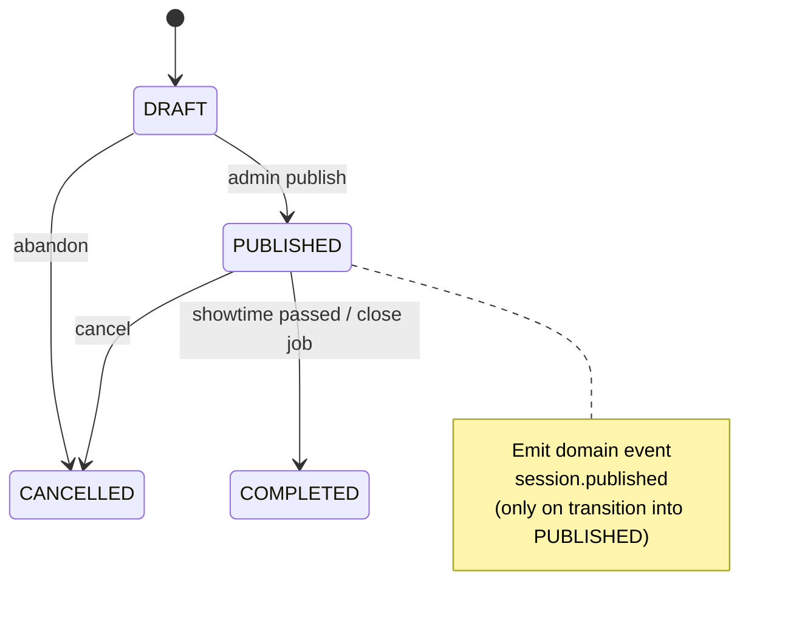
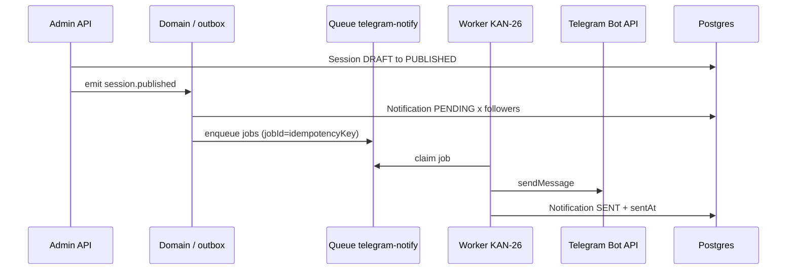

# Cinema Follow & Publish Notify (KAN-19)

**Status:** contract  
**Unblocks:** KAN-24 (follow UX / APIs), KAN-26 (Telegram bot notify worker)  
**Depends on:** [cinema-profile.md](./cinema-profile.md), existing `Notification` model, Telegram auth (KAN-5)  
**Locale MVP:** `ru`  
**Delivery channel MVP:** Telegram Bot (`Notification.channel = "TELEGRAM"`)

## Goal

Users can **follow** a cinema. When that cinema **publishes** new afisha / sessions, followers receive an in-app `Notification` row and a Bot delivery job (worker sends the Telegram message).

This contract defines: data model, follow/unfollow HTTP API, publish trigger, Notification + job payload shapes, and idempotency. **No Nest implementation in this PR.**

---

## Design decisions (locked)

| Topic | Decision |
| --- | --- |
| Trigger | **`Session.status` transition → `PUBLISHED`** (DRAFT→PUBLISHED or any→PUBLISHED). Primary afisha signal. |
| Movie catalog | `Movie` has `ACTIVE`/`ARCHIVED` only — **do not** emit follow-notify on movie create/ACTIVE alone. Sessions are the schedule unit users care about. |
| Batching | Optional short debounce (e.g. 60–120s) per cinema to coalesce burst publishes into one digest job — recommended, not required for MVP correctness. |
| Identity | Follow requires authenticated Mini App user (`User.id` from Telegram session). |
| Uniqueness | `CinemaFollow @@unique([userId, cinemaId])` |
| Notification reuse | Extend usage of existing `Notification` (`userId`, `channel`, `type`, `payload` Json, `status`, `sentAt`) — no new table for delivery log |
| Bot send | Worker owns Telegram `sendMessage`; API only enqueues job + writes Notification rows |

---

## Schema

See [schema-deltas.md § KAN-19](./schema-deltas.md#kan-19--cinema-profile--follow).

```prisma
model CinemaFollow {
  id        String   @id @default(cuid())
  userId    String
  cinemaId  String
  createdAt DateTime @default(now())

  user   User   @relation(fields: [userId], references: [id], onDelete: Cascade)
  cinema Cinema @relation(fields: [cinemaId], references: [id], onDelete: Cascade)

  @@unique([userId, cinemaId])
  @@index([cinemaId])
  @@index([userId])
}
```

`User.follows` / `Cinema.follows` reverse relations required.

### Notification `type` values (additive)

| `type` | When |
| --- | --- |
| `CINEMA_SESSION_PUBLISHED` | One or more sessions for a followed cinema became `PUBLISHED` |
| `CINEMA_AFISHA_DIGEST` | Optional batched digest after debounce window |

Existing types from KAN-7 remain unchanged.

---

## HTTP API

Auth: Mini App session (Telegram HMAC → Redis cookie / same SessionGuard as customer routes). Follow endpoints are **not** under anonymous public reads.

**Preferred mount** (adapt to neighboring customer routes in `apps/api/src`):

### `POST /cinemas/:cinemaId/follow`

Idempotent follow.

- Auth required (CUSTOMER or any logged-in user).
- Cinema must exist and `status = ACTIVE` else `404` / `409 CINEMA_NOT_FOLLOWABLE`.
- Upsert `CinemaFollow`; if already following → `200` with `{ following: true, created: false }`.
- New row → `201` `{ following: true, created: true }`.

### `DELETE /cinemas/:cinemaId/follow`

Unfollow.

- Deletes row if present; always `200` `{ following: false }` (idempotent).

### `GET /cinemas/:cinemaId/follow`

```json
{ "following": true, "followerCount": 120 }
```

Anonymous allowed for `followerCount`; `following` false if no session.

### `GET /me/follows`

List cinemas the current user follows:

```json
{
  "items": [
    {
      "cinemaId": "…",
      "name": "…",
      "logoUrl": null,
      "followedAt": "2026-09-11T07:00:00.000Z"
    }
  ]
}
```

> Path prefix note: if the codebase prefers customer-facing routes under `public/`, use `POST /public/cinemas/:id/follow` with SessionGuard — **implementers must match neighboring route style**. Contract semantics above are normative; exact mount path is a thin adapter choice documented in the implementation PR.

Public profile already exposes `followedByMe` / `followerCount` per [cinema-profile.md](./cinema-profile.md).

---

## Publish trigger



### Domain event `session.published`

Emitted **once per transition into `PUBLISHED`** (guard: previous status ≠ `PUBLISHED`).

```json
{
  "eventId": "evt_cuid…",
  "type": "session.published",
  "occurredAt": "2026-09-11T07:25:00.000Z",
  "cinemaId": "cin_…",
  "sessionId": "ses_…",
  "movieId": "mov_…",
  "startsAt": "2026-09-12T14:00:00.000Z",
  "hallId": "hall_…",
  "basePriceUzs": 45000
}
```

`eventId`: stable idempotency key for this transition — recommend `session.published:{sessionId}:{publishedRevision}` where `publishedRevision` is `updatedAt` ISO or a monotonic publish counter. MVP: `session.published:{sessionId}` is enough **if** re-publish after CANCELLED→PUBLISHED uses a new session row or appends `:{updatedAt}`.

**Re-publish rule:** If a session goes `PUBLISHED` → `CANCELLED` → `PUBLISHED` again, emit a **new** event (new `eventId`). Followers may get another notify — acceptable.

### Optional digest aggregator

Worker/API listener:

1. On `session.published`, push `sessionId` into Redis set `afisha:digest:{cinemaId}` and set PX debounce key.
2. When debounce fires, build one `CINEMA_AFISHA_DIGEST` per follower instead of N× `CINEMA_SESSION_PUBLISHED`.
3. If debounce disabled: one Notification + job per follower per event.

MVP default: **per-session notify** (`CINEMA_SESSION_PUBLISHED`); digest is optimization for KAN-26 if volume hurts.

---

## Notification row shape

```json
{
  "id": "ntf_…",
  "userId": "usr_…",
  "channel": "TELEGRAM",
  "type": "CINEMA_SESSION_PUBLISHED",
  "status": "PENDING",
  "payload": {
    "cinemaId": "cin_…",
    "cinemaName": "Navoiy Cinema",
    "sessionId": "ses_…",
    "movieId": "mov_…",
    "movieTitle": "Dune 2",
    "startsAt": "2026-09-12T14:00:00.000Z",
    "deepLink": "https://t.me/<bot>/<app>?startapp=session_ses_…",
    "locale": "ru"
  },
  "sentAt": null,
  "createdAt": "…"
}
```

Digest payload:

```json
{
  "cinemaId": "cin_…",
  "cinemaName": "Navoiy Cinema",
  "sessions": [
    {
      "sessionId": "ses_…",
      "movieTitle": "Dune 2",
      "startsAt": "2026-09-12T14:00:00.000Z"
    }
  ],
  "deepLink": "https://t.me/<bot>/<app>?startapp=cinema_cin_…",
  "locale": "ru"
}
```

### `status` lifecycle

`PENDING` → `SENT` (Bot OK, set `sentAt`) → or `FAILED` (retryable) → terminal `DEAD` after max attempts.

(Exact string enum may stay free-form `String` as today; document values in worker.)

---

## Telegram bot job payload (KAN-24 / KAN-26)

BullMQ (or equivalent) queue name: **`telegram-notify`**.

### Job name `notify.cinema.session_published`

```json
{
  "jobId": "notify:session.published:ses_…:usr_…",
  "notificationId": "ntf_…",
  "userId": "usr_…",
  "telegramId": "123456789",
  "locale": "ru",
  "template": "cinema_session_published",
  "text": "В «Navoiy Cinema» новый сеанс: Dune 2 — 12 сен, 19:00",
  "replyMarkup": {
    "inline_keyboard": [
      [{ "text": "Открыть сеанс", "url": "https://t.me/<bot>/<app>?startapp=session_ses_…" }]
    ]
  },
  "idempotencyKey": "notify:session.published:ses_…:usr_…"
}
```

### Job name `notify.cinema.afisha_digest`

Same envelope; `template: "cinema_afisha_digest"`; `idempotencyKey: "notify:afisha.digest:{cinemaId}:{windowId}:{userId}"`.

### Worker responsibilities (KAN-26)

1. Load user `telegramId`; skip if null (`Notification.status = FAILED`, reason `NO_TELEGRAM`).
2. `sendMessage` via Bot API.
3. Mark Notification `SENT` / `FAILED`.
4. Respect Telegram rate limits; per-job retries with backoff.
5. **Idempotency:** BullMQ `jobId` = `idempotencyKey`; duplicate enqueue is no-op. Also unique-check Notification before insert: logical unique `(type, userId, payload.sessionId)` for per-session type — enforce in service with find-or-create, or store `idempotencyKey` in payload and query.

### API / domain listener responsibilities (KAN-24 adjacent)

On `session.published`:

1. Load follower `userId`s for `cinemaId` (chunked).
2. For each follower: create `Notification` PENDING (idempotent) + enqueue `telegram-notify` job.
3. Do **not** call Telegram from the HTTP request that published the session.



---

## Idempotency matrix

| Layer | Key | Behavior |
| --- | --- | --- |
| Follow create | `@@unique([userId, cinemaId])` | Second POST → already following |
| Domain event | `eventId` / `session.published:{sessionId}:{rev}` | At-least-once safe |
| Notification insert | `(type, userId, sessionId)` logical | Skip duplicate PENDING/SENT |
| Queue job | `jobId` = `idempotencyKey` | BullMQ dedupe |
| Bot send | Check Notification status before send | Skip if already `SENT` |

---

## AuthZ / privacy

- Follower lists: **not** public beyond `followerCount`.
- Only the user can see `/me/follows`.
- Cinema admins do **not** get PII of followers in MVP (no export endpoint).

---

## Copy (ru) — suggested templates

**Per session:**  
`В «{{cinemaName}}» новый сеанс: {{movieTitle}} — {{startsAtLocal}}`

**Digest:**  
`В «{{cinemaName}}» обновлена афиша: {{count}} новых сеансов`

Exact formatting (`Asia/Tashkent` local) is worker concern; payload always carries ISO `startsAt`.

---

## Out of scope

- Push outside Telegram (email, Web Push).
- Per-user notify preferences / mute (add later as `CinemaFollow.muted` if needed).
- Notifying on `CANCELLED` / price changes (separate types later).
- Nest implementation / worker code in this PR.
