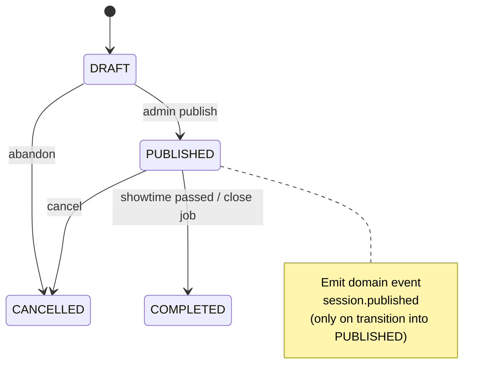
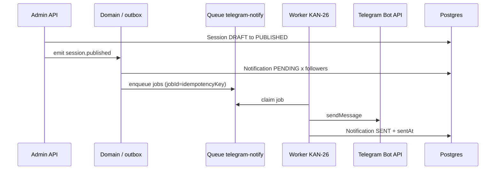
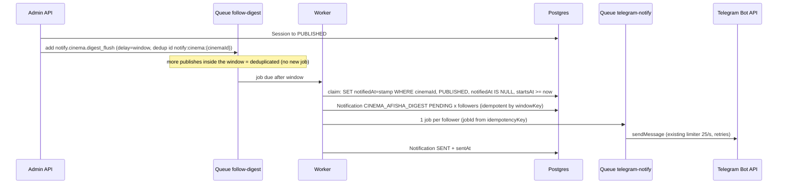

# Cinema Follow & Publish Notify (KAN-19)

**Status:** contract  
**Unblocks:** KAN-24 (follow UX / APIs), KAN-26 (Telegram bot notify worker)  
**Updated:** KAN-35 — per-cinema debounced digest replaces per-session messages ([§ KAN-35](#kan-35--per-cinema-digest-debounce))  
**Depends on:** [cinema-profile.md](./cinema-profile.md), existing `Notification` model, Telegram auth (KAN-5)  
**Locale MVP:** `ru`  
**Delivery channel MVP:** Telegram Bot (`Notification.channel = "TELEGRAM"`)

## Goal

Users can **follow** a cinema. When that cinema **publishes** new afisha / sessions, followers receive an in-app `Notification` row and a Bot delivery job (worker sends the Telegram message).

This contract defines: data model, follow/unfollow HTTP API, publish trigger, Notification + job payload shapes, and idempotency. **No Nest implementation in this PR.**

---

## Design decisions (locked)

| Topic | Decision |
| --- | --- |
| Trigger | **`Session.status` transition → `PUBLISHED`** (DRAFT→PUBLISHED or any→PUBLISHED). Primary afisha signal. |
| Movie catalog | `Movie` has `ACTIVE`/`ARCHIVED` only — **do not** emit follow-notify on movie create/ACTIVE alone. Sessions are the schedule unit users care about. |
| Batching | **KAN-35: required.** 5-minute debounce per cinema (`FOLLOW_NOTIFY_DEBOUNCE_MS`, default `300000`), key `notify:cinema:{cinemaId}` → one `CINEMA_AFISHA_DIGEST` message per follower. See [§ KAN-35](#kan-35--per-cinema-digest-debounce). |
| Identity | Follow requires authenticated Mini App user (`User.id` from Telegram session). |
| Uniqueness | `CinemaFollow @@unique([userId, cinemaId])` |
| Notification reuse | Extend usage of existing `Notification` (`userId`, `channel`, `type`, `payload` Json, `status`, `sentAt`) — no new table for delivery log |
| Bot send | Worker owns Telegram `sendMessage`; API only enqueues job + writes Notification rows |

---

## Schema

See [schema-deltas.md § KAN-19](./schema-deltas.md#kan-19--cinema-profile--follow).

```prisma
model CinemaFollow {
  id        String   @id @default(cuid())
  userId    String
  cinemaId  String
  createdAt DateTime @default(now())

  user   User   @relation(fields: [userId], references: [id], onDelete: Cascade)
  cinema Cinema @relation(fields: [cinemaId], references: [id], onDelete: Cascade)

  @@unique([userId, cinemaId])
  @@index([cinemaId])
  @@index([userId])
}
```

`User.follows` / `Cinema.follows` reverse relations required.

### Notification `type` values (additive)

| `type` | When |
| --- | --- |
| `CINEMA_SESSION_PUBLISHED` | One or more sessions for a followed cinema became `PUBLISHED` |
| `CINEMA_AFISHA_DIGEST` | Optional batched digest after debounce window |

Existing types from KAN-7 remain unchanged.

---

## HTTP API

Auth: Mini App session (Telegram HMAC → Redis cookie / same SessionGuard as customer routes). Follow endpoints are **not** under anonymous public reads.

**Preferred mount** (adapt to neighboring customer routes in `apps/api/src`):

### `POST /cinemas/:cinemaId/follow`

Idempotent follow.

- Auth required (CUSTOMER or any logged-in user).
- Cinema must exist and `status = ACTIVE` else `404` / `409 CINEMA_NOT_FOLLOWABLE`.
- Upsert `CinemaFollow`; if already following → `200` with `{ following: true, created: false }`.
- New row → `201` `{ following: true, created: true }`.

### `DELETE /cinemas/:cinemaId/follow`

Unfollow.

- Deletes row if present; always `200` `{ following: false }` (idempotent).

### `GET /cinemas/:cinemaId/follow`

```json
{ "following": true, "followerCount": 120 }
```

Anonymous allowed for `followerCount`; `following` false if no session.

### `GET /me/follows`

List cinemas the current user follows:

```json
{
  "items": [
    {
      "cinemaId": "…",
      "name": "…",
      "logoUrl": null,
      "followedAt": "2026-09-11T07:00:00.000Z"
    }
  ]
}
```

> Path prefix note: if the codebase prefers customer-facing routes under `public/`, use `POST /public/cinemas/:id/follow` with SessionGuard — **implementers must match neighboring route style**. Contract semantics above are normative; exact mount path is a thin adapter choice documented in the implementation PR.

Public profile already exposes `followedByMe` / `followerCount` per [cinema-profile.md](./cinema-profile.md).

---

## Publish trigger



### Domain event `session.published`

Emitted **once per transition into `PUBLISHED`** (guard: previous status ≠ `PUBLISHED`).

```json
{
  "eventId": "evt_cuid…",
  "type": "session.published",
  "occurredAt": "2026-09-11T07:25:00.000Z",
  "cinemaId": "cin_…",
  "sessionId": "ses_…",
  "movieId": "mov_…",
  "startsAt": "2026-09-12T14:00:00.000Z",
  "hallId": "hall_…",
  "basePriceUzs": 45000
}
```

`eventId`: stable idempotency key for this transition — recommend `session.published:{sessionId}:{publishedRevision}` where `publishedRevision` is `updatedAt` ISO or a monotonic publish counter. MVP: `session.published:{sessionId}` is enough **if** re-publish after CANCELLED→PUBLISHED uses a new session row or appends `:{updatedAt}`.

**Re-publish rule:** If a session goes `PUBLISHED` → `CANCELLED` → `PUBLISHED` again, emit a **new** event (new `eventId`). ~~Followers may get another notify — acceptable.~~ **KAN-35:** a session that was already included in a digest (`notifiedAt` set) is **not** announced again; a session cancelled before its window closed was never stamped, so re-publishing it makes it eligible for the next digest.

### Digest aggregator

~~Optional Redis-set aggregator / MVP per-session notify.~~ **Superseded by KAN-35** — see [§ KAN-35](#kan-35--per-cinema-digest-debounce). The API no longer sends `CINEMA_SESSION_PUBLISHED`; the type stays valid for historic rows and in-flight jobs.

---

## Notification row shape

```json
{
  "id": "ntf_…",
  "userId": "usr_…",
  "channel": "TELEGRAM",
  "type": "CINEMA_SESSION_PUBLISHED",
  "status": "PENDING",
  "payload": {
    "cinemaId": "cin_…",
    "cinemaName": "Navoiy Cinema",
    "sessionId": "ses_…",
    "movieId": "mov_…",
    "movieTitle": "Dune 2",
    "startsAt": "2026-09-12T14:00:00.000Z",
    "deepLink": "https://t.me/<bot>/<app>?startapp=session_ses_…",
    "locale": "ru"
  },
  "sentAt": null,
  "createdAt": "…"
}
```

Digest payload (`type: "CINEMA_AFISHA_DIGEST"`, KAN-35 — one row per follower per digest window):

```json
{
  "cinemaId": "cin_…",
  "cinemaName": "Navoiy Cinema",
  "windowKey": "cin_…:1790500000000",
  "sessions": [
    {
      "sessionId": "ses_…",
      "movieId": "mov_…",
      "movieTitle": "Dune 2",
      "startsAt": "2026-09-12T14:00:00.000Z"
    }
  ],
  "deepLink": "https://t.me/<bot>/<app>?startapp=cinema_cin_…",
  "locale": "ru",
  "idempotencyKey": "notify:afisha.digest:cin_…:1790500000000:usr_…",
  "text": "<b>Navoiy Cinema</b> — Новые сеансы\nDune 2 — 14:00, 17:30"
}
```

### `status` lifecycle

`PENDING` → `SENT` (Bot OK, set `sentAt`) → or `FAILED` (retryable) → terminal `DEAD` after max attempts.

(Exact string enum may stay free-form `String` as today; document values in worker.)

---

## Telegram bot job payload (KAN-24 / KAN-26)

BullMQ (or equivalent) queue name: **`telegram-notify`**.

### Job name `notify.cinema.session_published`

```json
{
  "jobId": "notify:session.published:ses_…:usr_…",
  "notificationId": "ntf_…",
  "userId": "usr_…",
  "telegramId": "123456789",
  "locale": "ru",
  "template": "cinema_session_published",
  "text": "В «Navoiy Cinema» новый сеанс: Dune 2 — 12 сен, 19:00",
  "replyMarkup": {
    "inline_keyboard": [
      [{ "text": "Открыть сеанс", "url": "https://t.me/<bot>/<app>?startapp=session_ses_…" }]
    ]
  },
  "idempotencyKey": "notify:session.published:ses_…:usr_…"
}
```

### Job name `notify.cinema.afisha_digest`

Same envelope; `template: "cinema_afisha_digest"`; `idempotencyKey: "notify:afisha.digest:{cinemaId}:{windowId}:{userId}"` where `windowId` = digest stamp in epoch ms (see KAN-35). `replyMarkup` = single button «Открыть афишу» → `deepLink` (`startapp=cinema_{cinemaId}`).

> **BullMQ jobId note (KAN-35):** BullMQ rejects custom job ids containing `:` (unless exactly 3 segments), so the queue `jobId` is `idempotencyKey` with `:` → `.` (e.g. `notify.afisha.digest.cin_….1790500000000.usr_…`). `idempotencyKey` itself keeps the format above.

### Worker responsibilities (KAN-26)

1. Load user `telegramId`; skip if null (`Notification.status = FAILED`, reason `NO_TELEGRAM`).
2. `sendMessage` via Bot API.
3. Mark Notification `SENT` / `FAILED`.
4. Respect Telegram rate limits; per-job retries with backoff.
5. **Idempotency:** BullMQ `jobId` = `idempotencyKey`; duplicate enqueue is no-op. Also unique-check Notification before insert: logical unique `(type, userId, payload.sessionId)` for per-session type — enforce in service with find-or-create, or store `idempotencyKey` in payload and query.

### API / domain listener responsibilities (KAN-24 adjacent)

On `session.published` (**KAN-35**):

1. Schedule the per-cinema digest job on queue `follow-digest` (debounced, key `notify:cinema:{cinemaId}`).
2. Follower fan-out (Notification rows + `telegram-notify` jobs) happens in the **worker** when the window closes.
3. Do **not** call Telegram from the HTTP request that published the session.

<details><summary>Pre-KAN-35 flow (per-session, kept for history)</summary>

1. Load follower `userId`s for `cinemaId` (chunked).
2. For each follower: create `Notification` PENDING (idempotent) + enqueue `telegram-notify` job.
</details>



---

## Idempotency matrix

| Layer | Key | Behavior |
| --- | --- | --- |
| Follow create | `@@unique([userId, cinemaId])` | Second POST → already following |
| Domain event | `eventId` / `session.published:{sessionId}:{rev}` | At-least-once safe |
| Notification insert | `(type, userId, sessionId)` logical | Skip duplicate PENDING/SENT |
| Queue job | `jobId` = `idempotencyKey` | BullMQ dedupe |
| Bot send | Check Notification status before send | Skip if already `SENT` |

---

## AuthZ / privacy

- Follower lists: **not** public beyond `followerCount`.
- Only the user can see `/me/follows`.
- Cinema admins do **not** get PII of followers in MVP (no export endpoint).

---

## Copy (ru) — suggested templates

**Per session:**  
`В «{{cinemaName}}» новый сеанс: {{movieTitle}} — {{startsAtLocal}}`

**Digest (KAN-35, normative):** see [message format](#message-format). ~~`В «{{cinemaName}}» обновлена афиша: {{count}} новых сеансов`~~

Exact formatting (`Asia/Tashkent` local) is worker concern; payload always carries ISO `startsAt`.

---

## Out of scope

- Push outside Telegram (email, Web Push).
- Per-user notify preferences / mute (add later as `CinemaFollow.muted` if needed).
- Notifying on `CANCELLED` / price changes (separate types later).
- Nest implementation / worker code in this PR (KAN-19). KAN-35 ships code for the digest.

---

## KAN-35 — per-cinema digest (debounce)

**Status:** implemented (API + worker). Review: System Designer.

### Flow



### Debounce window & key

| Item | Value |
| --- | --- |
| Queue | `follow-digest` (separate from `telegram-notify`, so the Telegram rate limiter only counts real sends) |
| Job name | `notify.cinema.digest_flush` |
| Job data | `{ cinemaId, deepLink, windowEndsAt }` |
| Debounce key | `notify:cinema:{cinemaId}` — BullMQ `deduplication.id` |
| Window | `FOLLOW_NOTIFY_DEBOUNCE_MS` (API + worker env), default `300000` (5 min). `0` = send on next worker tick. |
| Semantics | **Fixed window from the first publish** (not sliding): the first `PUBLISHED` opens the window, the job fires `window` ms later. Publishes while the job is *delayed* are deduplicated; the job reads the DB at run time, so they are still included. |
| Publish while the digest is *running* | `deduplication.keepLastIfActive = true` → BullMQ creates exactly one follow-up delayed job after the active one finishes. No parallel digests for one cinema. |
| Retries | `attempts: 5`, exponential backoff 2s. |
| Leftovers | After each run, if the cinema still has un-notified PUBLISHED future sessions (e.g. published during a retry backoff), the worker schedules the next window with the same key. |

Why not a plain deterministic `jobId = notify:cinema:{cinemaId}`: BullMQ keeps completed/failed jobs (`removeOnComplete`), and an existing id silently swallows later `add()` calls — the next window would never be scheduled, and a publish during the active run would be lost. `deduplication` gives the same "one job per key" guarantee while the job is pending, and releases the key when the job finishes.

### `Session.notifiedAt`

- `notifiedAt DateTime?` (nullable, additive). Index `(cinemaId, status, notifiedAt)`.
- `NULL` = not yet announced to followers.
- Set to the digest **stamp** (`windowEndsAt` of the job, epoch ms → DateTime) when the session is **claimed** into a digest, *before* fan-out. Actual per-user delivery time lives in `Notification.sentAt`.
- Claim is one atomic `UPDATE … WHERE notifiedAt IS NULL`, so two jobs can never both include a session → **a session is never announced twice**.
- Retry safety: a retried job has the same stamp; it reuses the sessions already stamped with it (does not re-claim), so the session set of a window never changes between attempts. Notification rows are find-or-create by `payload.windowKey`; followers whose row is `SENT` are skipped; `telegram-notify` jobIds are deterministic (duplicate add = no-op) and the send worker skips `SENT` rows.
- Migration backfill: sessions already `PUBLISHED` at deploy get `notifiedAt = updatedAt` so the first digest does not re-announce the existing afisha.
- Re-publish does **not** reset `notifiedAt`.

### Cancelled-session rule

- Only `status = PUBLISHED` and `startsAt >= now` sessions are claimed. A session cancelled (or moved back to non-PUBLISHED) inside the window is not claimed, not shown, and keeps `notifiedAt = NULL`.
- If a claimed session is cancelled before a *retry* of the same job, it is dropped from the text for followers not yet processed.
- Once a message is delivered it is not edited/recalled.

### Notification rows

One digest = **one** `Notification` per follower: `type = "CINEMA_AFISHA_DIGEST"`, payload above (`windowKey = {cinemaId}:{stampMs}`, `sessions[]` = all included sessions). Followers without `telegramId` → row `FAILED`, `failReason: "NO_TELEGRAM"`, no job.

### Message format

Telegram `parse_mode: HTML`; cinema name and film titles are HTML-escaped (`&`, `<`, `>`). Times in `Asia/Tashkent` (same as KAN-26).

```
<b>{cinemaName}</b> — Новые сеансы
{film 1} — 14:00, 17:30, 21:00
{film 2} — 12:00
…                        (max 5 films)
и ещё N фильмов          (only if > 5 films; Russian plural: фильм / фильма / фильмов)
```

- Films ordered by their earliest session; times ascending; identical times on the same day shown once.
- **Dates:** if every session in the digest is *today* (local), times only. Otherwise every film line carries compact dates: `Дюна 2 — 26 сент.: 14:00, 17:30; 27 сент.: 21:00`.
- One inline button, no per-session buttons:

```json
{ "inline_keyboard": [[{ "text": "Открыть афишу", "url": "<deepLink>" }]] }
```

### Button URL

Existing Mini App deep-link scheme (unchanged, same builder as KAN-26 `session_…` links):

- `TELEGRAM_MINI_APP_URL` set → `{TELEGRAM_MINI_APP_URL}?startapp=cinema_{cinemaId}` (`&startapp=` if the URL already has a query).
- otherwise → `https://t.me/{TELEGRAM_BOT_USERNAME}/{TELEGRAM_MINI_APP_SHORT_NAME}?startapp=cinema_{cinemaId}`.

Mini App route URLs are **not** changed (Design v2 condition). The Mini App page for a cinema remains `/cinemas/{id}`.

