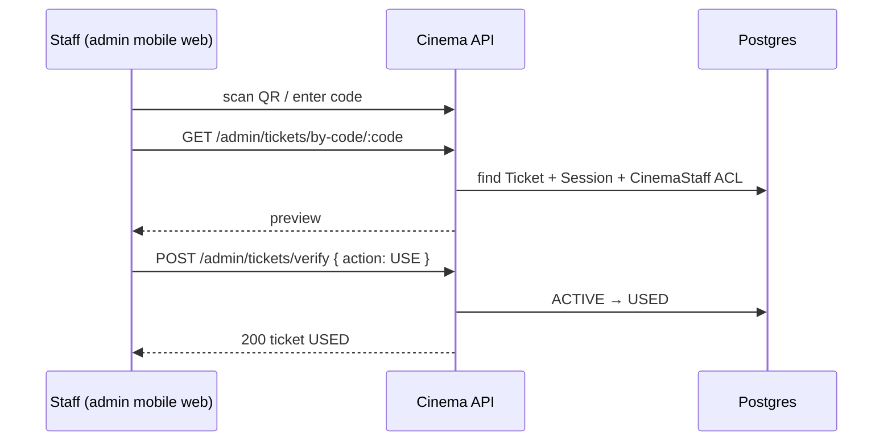
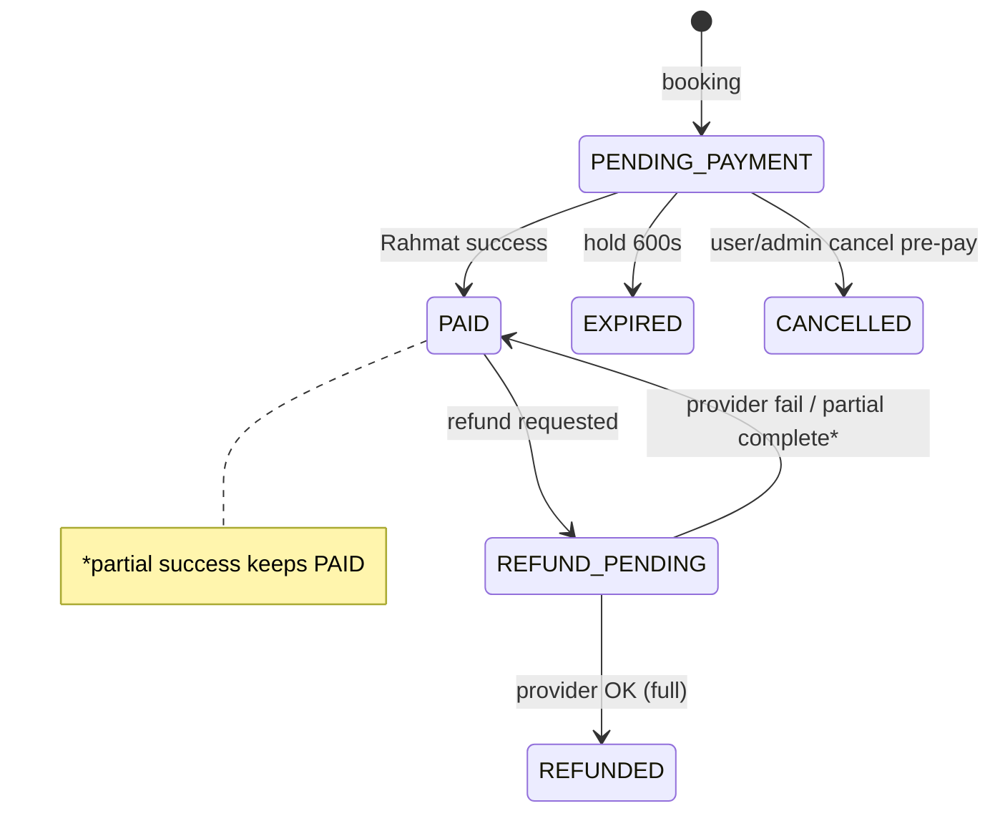
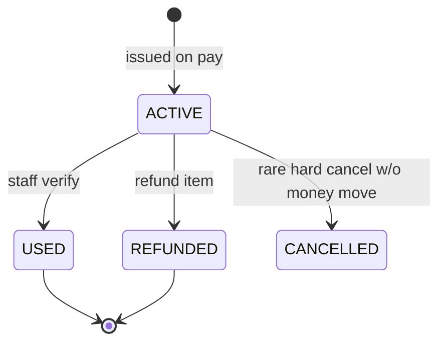
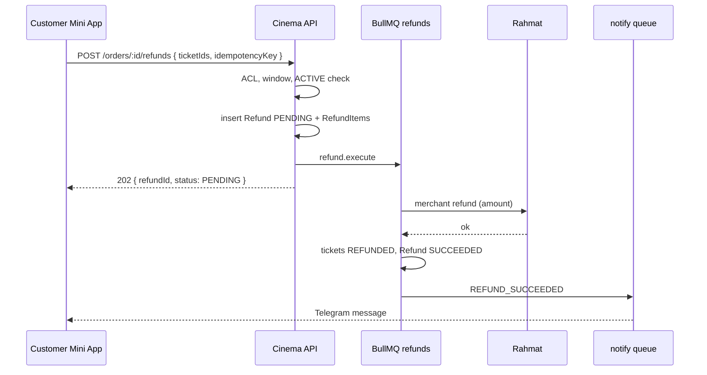

# QR Verify & Refund (KAN-7)

**Status:** contract  
**Depends on:** KAN-5 (identity), KAN-6 (Rahmat payment + refund port)  
**Locks:** partial refund **yes**; user self-refund **yes**; staff QR verify = **admin mobile web only**

## Goal

1. Define ticket `code` / QR payload format.
2. Staff verify endpoint for admin mobile web (mark ticket USED).
3. Full / partial / self-refund state machines.
4. Session cancel → refund jobs + Telegram notify.
5. BullMQ job shapes for `apps/worker` stub (Phase 09+).

---

## Ticket code & QR format

### Code

- Stored in `Ticket.code` (`@unique`).
- Generation (MVP): cryptographically random **12** chars from alphabet `A-Z2-9` (Crockford-ish, no `I/L/O/0/1`) → ~62 bits.
- Display: grouped `XXXX-XXXX-XXXX` in UI; store **without** dashes.
- Not derived from order id (prevents enumeration).

### QR payload

Encode a URL so scanners open admin verify deep link when possible:

```text
https://{ADMIN_ORIGIN}/m/tickets/verify?c={CODE}
```

Fallback plain-text payload (same CODE) if URL length is a concern — admin app accepts either URL query `c` or raw code.

**Not** a Rahmat ScanPay token. Staff verify is Cinema-internal; Rahmat ScanPay is out of scope for ticket entry.

### Visual

Mini App ticket screen: QR + human-readable code + movie/session/seat.

---

## Staff verify (admin mobile web only)

### Auth

- Existing admin session: email/password → Redis cookie.
- Caller must be `CinemaStaff` for the ticket’s cinema with role `STAFF` or `CINEMA_ADMIN` (or `SUPER_ADMIN` if product allows — default: **cinema-scoped staff only**; Super Admin privacy rules already hide customer PII on order list).

### `POST /admin/tickets/verify`

Body:

```json
{
  "code": "AB3K-9M2P-QX7R",
  "action": "USE"
}
```

(`code` may include dashes; server strips non-alphanumerics / uppercases.)

#### Behavior

| Ticket status | Result |
| --- | --- |
| `ACTIVE` | → `USED`, set `usedAt=now`, return ticket summary |
| `USED` | `409 TICKET_ALREADY_USED` (+ `usedAt`) |
| `CANCELLED` / `REFUNDED` | `409 TICKET_NOT_ACTIVE` |
| unknown code | `404 TICKET_NOT_FOUND` |
| wrong cinema | `403 FORBIDDEN` |

Response `200`:

```json
{
  "ticket": {
    "id": "…",
    "code": "AB3K9M2PQX7R",
    "status": "USED",
    "usedAt": "2026-09-11T12:00:00.000Z",
    "type": "SEAT",
    "seatLabel": "R5-12",
    "session": { "id": "…", "startsAt": "…", "movieTitle": "…" },
    "orderPublicNumber": 1042
  }
}
```

### `GET /admin/tickets/by-code/:code`

Read-only preview before confirm (same auth/cinema scope).

### Explicit non-goals

- No Mini App customer “scan to enter”.
- No public unauthenticated verify endpoint.
- Desktop admin may deep-link to the same mobile route but UX target is mobile web.



---

## Refund state machines

### Entities

- `Payment` (RAHMAT, typically `PAID`)
- `Order` (`PAID` | `REFUND_PENDING` | `REFUNDED`)
- `Ticket` (`ACTIVE` → `REFUNDED`; never refund `USED` by default)
- `Refund` + `RefundItem` (see [schema-deltas.md](./schema-deltas.md))
- `RefundInitiator`: `SELF` | `STAFF` | `SYSTEM`

### Shared guards

1. Payment must be `PAID` (or already `REFUND_PENDING` for in-flight).
2. Requested ticket ids must belong to the order and be `ACTIVE`.
3. `amountUzs` = sum of selected ticket unit prices (from OrderItem / Ticket price snapshot — MVP: OrderItem.unitPriceUzs).
4. Cumulative successful refunds + pending ≤ original payment amount.
5. Idempotency key required (client-generated UUID or server hash of `(orderId, sortedTicketIds, initiator)`).

### Full refund

All remaining `ACTIVE` tickets on the order.

```text
Order PAID
  → create Refund PENDING (initiator, items=all ACTIVE tickets)
  → Order REFUND_PENDING, Payment REFUND_PENDING
  → call Rahmat refund (full remaining amount)
  → on success: Refund SUCCEEDED; tickets REFUNDED; Payment REFUNDED; Order REFUNDED
  → on failure: Refund FAILED; Payment REFUND_FAILED; Order back to PAID (tickets still ACTIVE)
  → notify user
```

### Partial refund

Subset of `ACTIVE` tickets.

```text
Order stays PAID after success (MVP — ticket-level truth)
Payment stays PAID if remaining active value > 0
  else Payment REFUNDED + Order REFUNDED
Selected tickets → REFUNDED
Release seats: SessionSeat SOLD → AVAILABLE for refunded seat tickets (if session not started — policy below)
```

**Seat release policy (MVP):**

- If `Session.startsAt > now + 30m` (configurable): release seat to `AVAILABLE`.
- Else: leave seat `SOLD` / mark blocked — no resale near showtime (**ASSUMPTION-S1**).

### Self-refund (customer Mini App)

#### `POST /orders/:orderId/refunds`

Auth: customer owns order.

Body:

```json
{
  "ticketIds": ["…", "…"],
  "reason": "changed plans",
  "idempotencyKey": "…"
}
```

Rules:

- Initiator `SELF`.
- Allowed while session `startsAt` is more than **N** minutes away (default **N=60**). Closer → `403 SELF_REFUND_WINDOW_CLOSED` (staff may still refund).
- Cannot refund `USED` tickets.
- Empty `ticketIds` = all ACTIVE tickets (full).

### Staff refund

#### `POST /admin/orders/:orderId/refunds`

Auth: cinema staff.

Same body + optional `forceUsed: false` (default). Staff can refund within/without self-window. Initiator `STAFF`, `initiatedByUserId` = staff user.

### SYSTEM refund

Enqueued by session cancel / late-pay auto-refund. Initiator `SYSTEM`, `initiatedByUserId` null.

---

## Order / Payment / Ticket status matrix

| Event | Order | Payment | Tickets |
| --- | --- | --- | --- |
| Pay success | `PAID` | `PAID` | create `ACTIVE` |
| Partial refund OK | `PAID` | `PAID` | subset `REFUNDED` |
| Full refund OK | `REFUNDED` | `REFUNDED` | all `REFUNDED` |
| Refund in flight | `REFUND_PENDING` | `REFUND_PENDING` | unchanged until success |
| Refund fail | `PAID` | `REFUND_FAILED` | unchanged |
| Staff verify | — | — | `ACTIVE`→`USED` |
| Session cancel | `REFUND_PENDING`→`REFUNDED` | via jobs | `ACTIVE`→`REFUNDED` |





---

## Session cancel → refund jobs + Telegram notify

When admin sets `Session.status = CANCELLED`:

1. Select all `Order` with `status=PAID` for that session (and tickets `ACTIVE`/`USED` — **ASSUMPTION-S2:** refund USED too on full session cancel, with reason `SESSION_CANCELLED`).
2. For each order, enqueue `refund.session_cancel` job (SYSTEM full refund of refundable tickets).
3. On each success, enqueue `notify.telegram` with type `SESSION_CANCELLED`.
4. Seat inventory: all session seats → `AVAILABLE` or leave as cancelled session (no further booking).

### Job: `refund.session_cancel`

```json
{
  "name": "refund.session_cancel",
  "data": {
    "sessionId": "clx…",
    "orderId": "clx…",
    "reason": "SESSION_CANCELLED",
    "idempotencyKey": "session-cancel:{sessionId}:{orderId}"
  },
  "opts": {
    "jobId": "session-cancel:{sessionId}:{orderId}",
    "attempts": 5,
    "backoff": { "type": "exponential", "delay": 60000 }
  }
}
```

Worker:

1. Create/find Refund SYSTEM + RefundItems.
2. Call `RahmatPaymentProvider.refund`.
3. Update statuses.
4. Enqueue notify.

---

## BullMQ job shapes (`apps/worker` stub → Phase 09+)

Queue names (suggested):

| Queue | Purpose |
| --- | --- |
| `payments` | poll Rahmat status, late-pay auto-refund |
| `refunds` | execute provider refunds |
| `notifications` | Telegram outbound |
| `holds` | optional: move hold expiry off API scheduler |

### `payments.poll_status`

```json
{
  "name": "payments.poll_status",
  "data": {
    "paymentId": "clx…",
    "orderId": "clx…"
  },
  "opts": {
    "repeat": null,
    "attempts": 10,
    "backoff": { "type": "fixed", "delay": 15000 }
  }
}
```

Stop when Payment terminal or Order expired + auto-refund enqueued.

### `refund.execute`

```json
{
  "name": "refund.execute",
  "data": {
    "refundId": "clx…",
    "paymentId": "clx…",
    "amountUzs": 45000,
    "idempotencyKey": "…",
    "initiator": "SELF"
  },
  "opts": {
    "jobId": "refund:{idempotencyKey}",
    "attempts": 5,
    "backoff": { "type": "exponential", "delay": 30000 }
  }
}
```

### `notify.telegram`

```json
{
  "name": "notify.telegram",
  "data": {
    "userId": "clx…",
    "telegramId": "123456789",
    "type": "REFUND_SUCCEEDED",
    "payload": {
      "orderPublicNumber": 1042,
      "amountUzs": 45000,
      "ticketCodes": ["AB3K9M2PQX7R"]
    }
  },
  "opts": {
    "attempts": 5,
    "backoff": { "type": "exponential", "delay": 10000 }
  }
}
```

Worker persists `Notification` row (`channel=TELEGRAM`, `status=PENDING|SENT|FAILED`) then sends via Bot API.

### `refund.late_payment`

```json
{
  "name": "refund.late_payment",
  "data": {
    "paymentId": "clx…",
    "orderId": "clx…",
    "reason": "PAID_AFTER_HOLD_EXPIRED",
    "idempotencyKey": "late-pay:{paymentId}"
  }
}
```

---

## Customer / staff API error codes

| Code | HTTP | Meaning |
| --- | --- | --- |
| `SELF_REFUND_WINDOW_CLOSED` | 403 | Too close to session start |
| `TICKET_NOT_REFUNDABLE` | 409 | USED / already REFUNDED |
| `REFUND_AMOUNT_EXCEEDED` | 409 | Cumulative cap |
| `PAYMENT_NOT_PAID` | 409 | Nothing to refund |
| `IDEMPOTENCY_CONFLICT` | 409 | Same key different body |
| `PARTIAL_REFUND_UNSUPPORTED` | 501 | Rahmat sandbox limitation (ASSUMPTION-R2) |
| `TICKET_ALREADY_USED` | 409 | Verify |
| `TICKET_NOT_FOUND` | 404 | Verify / refund |

---

## Sequence — self partial refund



---

## Open assumptions

| ID | Assumption |
| --- | --- |
| S1 | Seat release cutoff 30m before start on partial refund |
| S2 | Session cancel refunds USED tickets too |
| S3 | Self-refund window default 60m before start |
| R1/R2 | Rahmat merchant refund + partial (from KAN-6) |

---

## Implementation notes

- No NestJS production code in the contracts PR.
- Worker remains stub until Phase 09+; API may call Rahmat refund **inline** for MVP if queue not ready, but must still write `Refund` rows and be idempotent.
- QR verify is synchronous (no queue).
