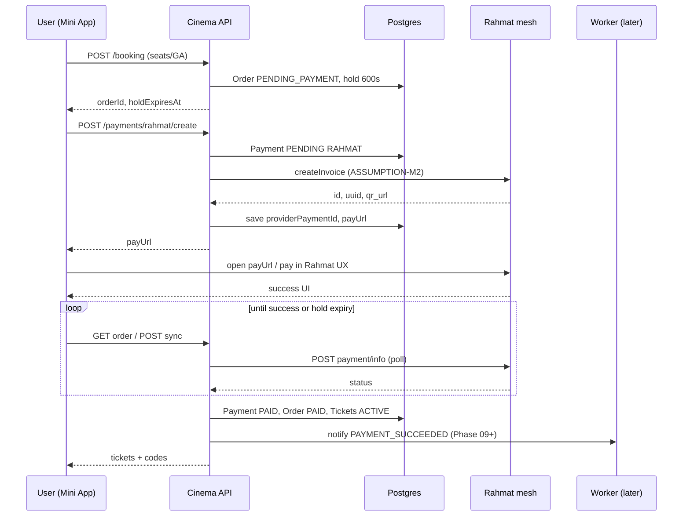
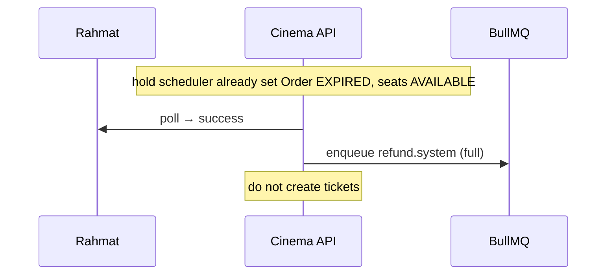

# Rahmat Payment Provider (KAN-6)

**Status:** contract  
**Provider lock:** **Rahmat** (`rhmt.uz`) — Click / Payme **deprecated for MVP**  
**Merchant model:** **A — cinema merchant account**  
**Public docs:** https://app.docs.rhmt.uz (fetched 2026-09-11)

## Goal

Define the Cinema ↔ Rahmat integration so that:

1. Booking creates `Order` `PENDING_PAYMENT` (existing **600s** hold).
2. Cinema creates a Rahmat invoice / pay session and returns a deeplink / QR URL to the Mini App.
3. On confirmed payment → `Payment` `PAID`, `Order` `PAID`, emit `Ticket` rows `ACTIVE` (unique `code`).
4. Status poll + refund APIs are idempotent; callbacks never double-fulfill.

---

## Critical model note (read first)

Rahmat’s **public Partner docs** describe Rahmat as an aggregator that routes the payer into a **Partner payment app** (Click/Payme-style). In that model:

- Rahmat → Partner: deeplink with `amount`, `rahmat_trans_id`, `return_url`
- Partner charges the user and **POSTs Callback → Rahmat**
- Partner exposes Status / Refund / Reconciliation / Fiscal endpoints that **Rahmat calls**

Cinema product lock is the **inverse role**: Cinema is a **merchant** selling tickets; Rahmat is the **payment rail** the customer uses to pay Cinema.

### Merchant Model A (locked) — cinema-as-merchant

```text
Mini App / User  →  Cinema API  →  Rahmat (merchant invoice)  →  User pays in Rahmat UX
                         ↑                                         |
                         └──────── status poll / webhook ←─────────┘
```

| Cinema responsibility | Rahmat responsibility |
| --- | --- |
| Create invoice for order amount (UZS → tiyin) | Host pay page / QR / app checkout |
| Store Rahmat ids on `Payment` | Capture / confirm funds |
| Mark Order PAID + issue tickets on confirmed `success` | Expose payment info / status |
| Initiate refunds for ticket returns | Execute / confirm refund (`revert`) |

**ASSUMPTION-M1:** Rahmat onboards Cinema as a **store / merchant** (TIN, MCC, settlement account) and issues API credentials (Basic Auth username/password per [API-методы](https://app.docs.rhmt.uz/api-%D0%BC%D0%B5%D1%82%D0%BE%D0%B4%D1%8B-1959307m0) — sandbox `https://dev-mesh.multicard.uz`, prod `https://mesh.multicard.uz`).

**ASSUMPTION-M2:** There exists a **merchant “create invoice”** (or create payment) API that returns at least `{ id, uuid, qr_url | pay_url, status }` aligned with the documented payment-info shape (`id`, `uuid`, `status`, `qr_url`, `payment_amount`, …). Exact path/body is **TBD with Rahmat Pay** — Partner docs document *reading* invoices (`invoice_uuid`) and payment info, not the merchant create call.

**ASSUMPTION-M3:** Cinema learns success primarily via:

1. **Server-side status poll** of Rahmat payment info (`POST …/payment/info/payment-app/{app_name}` with `partner_trans_id` | `rahmat_trans_id` | `invoice_uuid`), and/or
2. An **inbound merchant webhook** if Rahmat provides one for stores (not clearly specified in Partner docs — treat as optional until confirmed).

**ASSUMPTION-M4:** Cinema does **not** implement the Partner Callback → Rahmat direction (that is for payment apps). If Rahmat mistakenly classifies Cinema as Partner, escalate — do not build Partner deeplink checkout into Cinema Mini App.

**ASSUMPTION-M5:** Amounts are integers in **tiyin** (1 UZS = 100 tiyin). Cinema stores **UZS** integers today (`amountUzs`); convert at the Rahmat boundary: `tiyin = amountUzs * 100`.

Document every TBD with Rahmat Pay before production go-live; test-case checklist exists on [опросник](https://app.docs.rhmt.uz/%D0%BE%D0%BF%D1%80%D0%BE%D1%81%D0%BD%D0%B8%D0%BA-%D0%B4%D0%BB%D1%8F-%D0%BF%D0%BE%D0%B4%D0%BA%D0%BB%D1%8E%D1%87%D0%B5%D0%BD%D0%B8%D1%8F-%D0%B8-%D0%B7%D0%B0%D0%BF%D1%83%D1%81%D0%BA%D0%B0-1959308m0).

---

## Prisma

Add enum value (see [schema-deltas.md](./schema-deltas.md)):

```prisma
enum PaymentProvider {
  RAHMAT
  CLICK  // deprecated MVP
  PAYME  // deprecated MVP
}
```

`Payment @@unique([provider, providerPaymentId])` — for Rahmat store `providerPaymentId = String(rahmat.id)` (or uuid; pick one and never mix).

---

## PaymentProvider interface (Cinema internal)

```ts
interface PaymentProviderPort {
  /** Create Rahmat invoice / payment for a PENDING_PAYMENT order. Idempotent on orderId. */
  createInvoice(input: {
    orderId: string;
    amountUzs: number;
    description: string;
    returnUrl: string;       // Mini App deep link after pay
    idempotencyKey: string;  // e.g. `order:{orderId}:pay`
  }): Promise<{
    providerPaymentId: string;
    invoiceUuid?: string;
    payUrl: string;          // qr_url or https://app.rhmt.uz/invoice/{uuid}
    deeplinkUrl?: string;
    expiresAt?: Date;
  }>;

  /** Poll Rahmat for current status. */
  getStatus(ref: {
    providerPaymentId?: string;
    invoiceUuid?: string;
    partnerTransId?: string; // Cinema Payment.id or order public number
  }): Promise<{
    status: "draft" | "progress" | "billing" | "success" | "cancelled" | "revert" | "error";
    amountTiyin: number;
    paidAt?: string;
    raw: unknown;
  }>;

  /** Merchant-initiated refund (full or partial). Idempotent on idempotencyKey. */
  refund(input: {
    providerPaymentId: string;
    amountUzs: number;       // partial allowed by product lock
    idempotencyKey: string;
    reason?: string;
  }): Promise<{
    providerRefundId: string;
    status: "pending" | "succeeded" | "failed";
    raw: unknown;
  }>;
}
```

MVP wiring: only `RahmatPaymentProvider` is registered. Click/Payme adapters are not shipped.

---

## HTTP endpoints (Cinema API)

### Customer / Mini App

#### `POST /payments/rahmat/create`

Auth: customer session (Telegram).

Body:

```json
{ "orderId": "clx..." }
```

Behavior:

1. Load order; must be owner; status `PENDING_PAYMENT`; `holdExpiresAt > now`.
2. Upsert `Payment` row: `provider=RAHMAT`, `status=PENDING`, `amountUzs=order.totalUzs`.
3. Call `createInvoice` with `idempotencyKey=order:{orderId}:pay` (reuse existing PENDING payment if present).
4. Persist `providerPaymentId` / invoice uuid / pay URL.
5. Return:

```json
{
  "paymentId": "clx...",
  "orderId": "clx...",
  "provider": "RAHMAT",
  "status": "PENDING",
  "amountUzs": 45000,
  "payUrl": "https://app.rhmt.uz/invoice/…",
  "holdExpiresAt": "2026-09-11T07:12:00.000Z"
}
```

Mini App opens `payUrl` via `Telegram.WebApp.openLink(payUrl)` (external) or shows QR.

#### `GET /payments/:paymentId` / `GET /orders/:orderId/payment`

Return local Payment + Order status (after poll/webhook applied).

#### `POST /payments/:paymentId/sync` (optional)

Triggers one Rahmat `getStatus` and applies transition if `success`.

### Inbound (Rahmat → Cinema) — if merchant webhook exists

#### `POST /webhooks/rahmat/payment`

**ASSUMPTION-M3b:** Path/auth TBD. Until confirmed, implement **poll-first**.

Recommended hardening when webhook arrives:

- Verify Basic Auth or shared secret header.
- Idempotent by `(provider, providerPaymentId)` + event id if present.
- Only transition PENDING → PAID on terminal `success`.
- Respond `200` quickly; heavy work in transaction / queue.

### Admin / ops

#### `GET /admin/payments/:id` — inspect rawPayload (mask PAN/PII).

---

## Status mapping

| Rahmat status | Cinema `PaymentStatus` | `OrderStatus` | Tickets |
| --- | --- | --- | --- |
| `draft` / `progress` / `billing` | `PENDING` | `PENDING_PAYMENT` | none |
| `success` | `PAID` | `PAID` | create `ACTIVE` |
| `cancelled` / `error` | `FAILED` | stay `PENDING_PAYMENT` until hold expiry → `EXPIRED` | none |
| `revert` | `REFUNDED` | see [qr-refund.md](./qr-refund.md) | `REFUNDED` |

### Fulfillment transition (atomic)

On first observation of Rahmat `success` for a payment:

```text
BEGIN
  UPDATE Payment SET status=PAID WHERE id=? AND status=PENDING  -- optimistic
  UPDATE Order SET status=PAID WHERE id=? AND status=PENDING_PAYMENT
  FOR each OrderItem: INSERT Ticket (code unique, status ACTIVE)
  UPDATE SessionSeat HELD→SOLD for linked seats
COMMIT
Enqueue notify PAYMENT_SUCCEEDED
```

If order already `EXPIRED`/`CANCELLED` when success arrives → **do not** issue tickets; enqueue auto-refund job (SYSTEM) — edge case for late pay after hold.

Idempotency: second success observation is a no-op (payment already PAID).

---

## Rahmat API alignment (from public docs)

Base URLs:

| Env | Base |
| --- | --- |
| Sandbox | `https://dev-mesh.multicard.uz` |
| Production | `https://mesh.multicard.uz` |

Auth: `Authorization: Basic base64(user:pass)` (HTTPS only).

### Payment info (Cinema → Rahmat) — documented

```http
POST {rahmat_base}/payment/info/payment-app/{app_name}
Content-Type: application/json
```

Body — exactly one of:

```json
{ "partner_trans_id": "<Cinema Payment.id>" }
```
```json
{ "rahmat_trans_id": "<id>" }
```
```json
{ "invoice_uuid": "<uuid>" }
```

Use for status poll / reconciliation. Map `data.status` as above. Field `id` is Rahmat trans id; `uuid` is payment/invoice uuid; `qr_url` for UX.

### Callback (Partner → Rahmat) — **not Cinema’s outbound**

Documented Callback is for **Partners**. Cinema merchant flow does not POST this unless Rahmat explicitly requires a hybrid setup (**ASSUMPTION-M4**).

### Refund

Partner docs: Rahmat → Partner `POST {partner}/refund` with `{ partner_trans_id }` (full refund). Product requires **Cinema-initiated** full **and partial** refunds.

**ASSUMPTION-R1:** Merchant refund is a Cinema → Rahmat API (path TBD). Until confirmed, design Cinema `PaymentProviderPort.refund` and keep a feature flag; partial amount field is required by product even if first Rahmat sandbox build only supports full refund — then reject partial with `501 PARTIAL_REFUND_UNSUPPORTED` and track with Rahmat.

**ASSUMPTION-R2:** Partial refund support on Rahmat side may need a separate contract (“partial return”) as noted in Partner Refund API text.

### Fiscal / reconciliation

Out of MVP critical path but plan hooks:

- Store `receipt_url` / fiscal link on Payment when available.
- Daily reconciliation job (Phase 09+ worker) comparing Rahmat report vs local Payments.

---

## Sequence — create + pay + fulfill



---

## Sequence — late payment after hold



---

## Idempotency rules

| Operation | Key | Rule |
| --- | --- | --- |
| createInvoice | `order:{orderId}:pay` | One PENDING/PAID Payment per order for MVP |
| fulfill | `paymentId` + status PAID | Single-flight DB conditional update |
| webhook | `provider+providerPaymentId[+eventId]` | Ignore duplicates |
| refund | `Refund.idempotencyKey` | See KAN-7 |

---

## Config / secrets

| Env | Purpose |
| --- | --- |
| `RAHMAT_BASE_URL` | sandbox or prod mesh |
| `RAHMAT_APP_NAME` | `{app_name}` path segment |
| `RAHMAT_BASIC_USER` / `RAHMAT_BASIC_PASSWORD` | Basic Auth |
| `RAHMAT_STORE_ID` | if createInvoice needs store ref (**TBD**) |
| `RAHMAT_WEBHOOK_SECRET` | inbound auth if applicable |

Never log full Basic Auth, PAN, PINFL.

---

## Deprecation of Click / Payme

- New code paths MUST NOT instantiate Click/Payme.
- Enum values retained so historical rows and migrations do not break.
- Admin UI copy: “Rahmat only (MVP)”.

---

## Open assumptions checklist (blockers for prod)

| ID | Assumption | Confirm with |
| --- | --- | --- |
| M1 | Cinema onboarded as merchant/store with Basic Auth | Rahmat Pay |
| M2 | Create-invoice API path/body/response | Rahmat Pay |
| M3 | Poll vs webhook as source of truth | Rahmat Pay |
| M4 | Cinema is not a Partner payment app | Product + Rahmat |
| M5 | tiyin = UZS × 100 | Rahmat Pay |
| R1 | Merchant-initiated refund API | Rahmat Pay |
| R2 | Partial refund supported or staged | Rahmat Pay |
