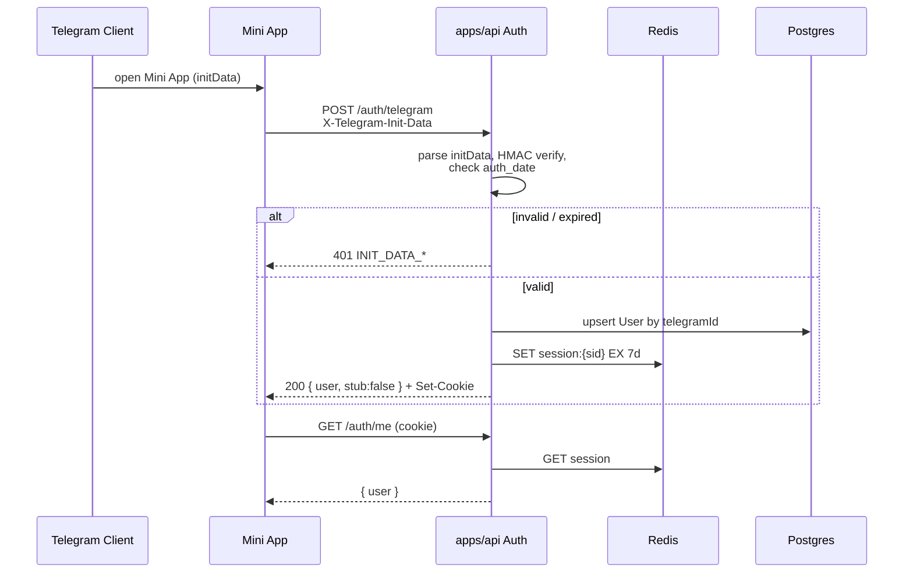

# Telegram Mini App Auth (KAN-5)

**Status:** contract  
**Replaces:** `AuthService.telegramStub` / `POST /auth/telegram` stub path  
**Refs:** [Telegram WebApp — Validating data](https://core.telegram.org/bots/webapps#validating-data-received-via-the-mini-app)

## Goal

Authenticate Mini App users with **real `initData` HMAC verification**, upsert `User` by `telegramId`, and issue the same Redis session cookie used by admin login.

## Current behavior (must migrate away)

| Fact | Detail |
| --- | --- |
| Endpoint | `POST /auth/telegram` |
| Implementation | `AuthService.telegramStub` |
| If `TELEGRAM_BOT_TOKEN` set | Requires `body.initData`, but **does not verify HMAC** |
| Identity | Trusts `body.telegramId` / defaults to `"dev-telegram-user"` |
| Session | Redis `session:{sid}`, cookie `SESSION_COOKIE`, TTL 7d |
| Response | `{ user, stub: true }` |

Admin path (`POST /auth/login`) stays email/password + Redis cookie — unchanged by this contract.

---

## Endpoint

### `POST /auth/telegram`

Authenticate a Telegram Mini App user and set session cookie.

#### Request — preferred: header

```http
POST /auth/telegram HTTP/1.1
Content-Type: application/json
X-Telegram-Init-Data: <raw Telegram.WebApp.initData query string>
```

Body may be empty `{}` when the header is present.

#### Request — fallback: body

Useful for clients that cannot set custom headers (some WebView proxies) or for local tooling:

```json
{
  "initData": "<raw Telegram.WebApp.initData query string>"
}
```

**Resolution order:**

1. Header `X-Telegram-Init-Data` (trim; non-empty wins)
2. Else `body.initData`
3. Else → `401` `INIT_DATA_REQUIRED`

> Do **not** accept client-supplied `telegramId` / `username` as identity once HMAC is enabled. Derive them only from verified `initData` fields.

#### Success response `200`

```json
{
  "user": {
    "id": "clx...",
    "email": null,
    "role": "CUSTOMER",
    "staff": []
  },
  "stub": false
}
```

Sets httpOnly session cookie (same options as login: `sameSite=lax`, path `/`, maxAge 7d). Production MUST set `secure: true` behind HTTPS (separate hardening ticket OK).

#### Errors

| HTTP | Code | When |
| --- | --- | --- |
| 401 | `INIT_DATA_REQUIRED` | Missing header and body `initData` |
| 401 | `INIT_DATA_INVALID` | HMAC mismatch or malformed query string |
| 401 | `INIT_DATA_EXPIRED` | `auth_date` older than allowed skew (default **86400s**) |
| 401 | `USER_MISSING` | Valid data but no `user` object in initData |
| 503 | `BOT_TOKEN_UNCONFIGURED` | Production without `TELEGRAM_BOT_TOKEN` |

Dev-only escape hatch (optional, gated by `NODE_ENV !== 'production'` **and** unset/empty bot token): keep a clearly labeled stub that returns `stub: true`. Never available when token is configured.

---

## HMAC verification steps

Per Telegram WebApp docs:

1. Parse `initData` as `application/x-www-form-urlencoded` key/value pairs.
2. Extract `hash` (hex). Remove `hash` from the set used for signing. (`signature` is for third-party Ed25519 checks — **not** used for bot-token HMAC; ignore for this endpoint.)
3. Build **data-check-string**: remaining pairs sorted by key ascending, each as `key=value`, joined with `\n` (LF, `0x0A`).
4. `secret_key = HMAC_SHA256(key="WebAppData", message=TELEGRAM_BOT_TOKEN)`  
   (Telegram: HMAC-SHA-256 of the bot token with constant string `WebAppData` as key.)
5. `computed = hex(HMAC_SHA256(key=secret_key, message=data-check-string))`.
6. Compare `computed` to `hash` with **constant-time** equality.
7. Parse `auth_date` (Unix seconds). Reject if `now - auth_date > AUTH_MAX_AGE_SEC` (default 86400) or if `auth_date` is in the far future (> 60s skew).
8. Parse `user` JSON → require `user.id`. Map:
   - `telegramId = String(user.id)` (Telegram ids can exceed 32-bit)
   - `telegramUsername = user.username ?? null`
   - `firstName = user.first_name ?? null`
   - `lastName = user.last_name ?? null`
   - optional: `language_code`, `photo_url` (store later if product needs)

### Pseudocode

```ts
function verifyTelegramInitData(initData: string, botToken: string, maxAgeSec = 86400) {
  const params = new URLSearchParams(initData);
  const hash = params.get("hash");
  if (!hash) throw unauthorized("INIT_DATA_INVALID");
  params.delete("hash");
  params.delete("signature"); // not part of bot HMAC check-string

  const dataCheckString = [...params.entries()]
    .sort(([a], [b]) => a.localeCompare(b))
    .map(([k, v]) => `${k}=${v}`)
    .join("\n");

  const secretKey = createHmac("sha256", "WebAppData").update(botToken).digest();
  const computed = createHmac("sha256", secretKey).update(dataCheckString).digest("hex");
  if (!timingSafeEqual(Buffer.from(computed), Buffer.from(hash))) {
    throw unauthorized("INIT_DATA_INVALID");
  }

  const authDate = Number(params.get("auth_date"));
  if (!Number.isFinite(authDate) || Date.now() / 1000 - authDate > maxAgeSec) {
    throw unauthorized("INIT_DATA_EXPIRED");
  }

  const user = JSON.parse(params.get("user") ?? "null");
  if (!user?.id) throw unauthorized("USER_MISSING");
  return user;
}
```

---

## Upsert + session

After verification:

```ts
await prisma.user.upsert({
  where: { telegramId: String(user.id) },
  update: {
    telegramUsername: user.username ?? null,
    firstName: user.first_name ?? null,
    lastName: user.last_name ?? null,
  },
  create: {
    telegramId: String(user.id),
    telegramUsername: user.username ?? null,
    firstName: user.first_name ?? null,
    lastName: user.last_name ?? null,
    role: "CUSTOMER",
  },
});
// create Redis session + set cookie (same as telegramStub / login)
```

`GET /auth/me` and `SessionGuard` remain unchanged.

---

## Mini App client contract

1. Load `telegram-web-app.js`.
2. Call `Telegram.WebApp.ready()`.
3. On boot / before API calls that need auth:

```ts
await fetch(`${API}/auth/telegram`, {
  method: "POST",
  credentials: "include",
  headers: {
    "Content-Type": "application/json",
    "X-Telegram-Init-Data": Telegram.WebApp.initData,
  },
  body: "{}",
});
```

4. Prefer header; body fallback only if header blocked.
5. Never send forged `telegramId` from `initDataUnsafe` without server verification.

---

## Sequence



---

## Migration from stub

| Phase | Action |
| --- | --- |
| 1 | Implement `verifyTelegramInitData`; wire into `POST /auth/telegram` |
| 2 | Ignore / reject body `telegramId` when token configured |
| 3 | Response always `stub: false` when HMAC path used |
| 4 | Remove `telegramStub` name; keep optional unauthenticated local stub behind explicit `AUTH_TELEGRAM_STUB=1` |
| 5 | Mini App sends header; CI e2e uses signed fixture initData |

### Test fixtures

- Generate initData with known bot token in unit tests.
- Cases: valid; tampered hash; expired `auth_date`; missing `user`; header vs body precedence.

---

## Security notes

- Never log full `initData` or bot token.
- Constant-time hash compare.
- `TELEGRAM_BOT_TOKEN` only on API (and worker if needed) — never in Mini App bundle.
- Session fixation: always mint a **new** `sid` on successful telegram auth.
